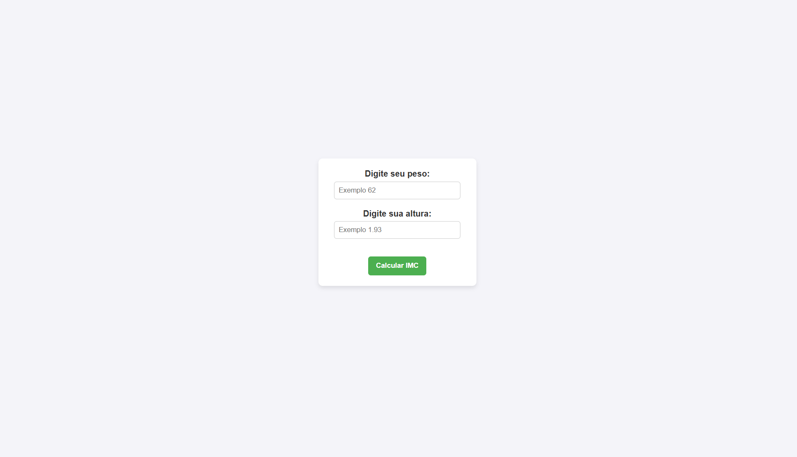
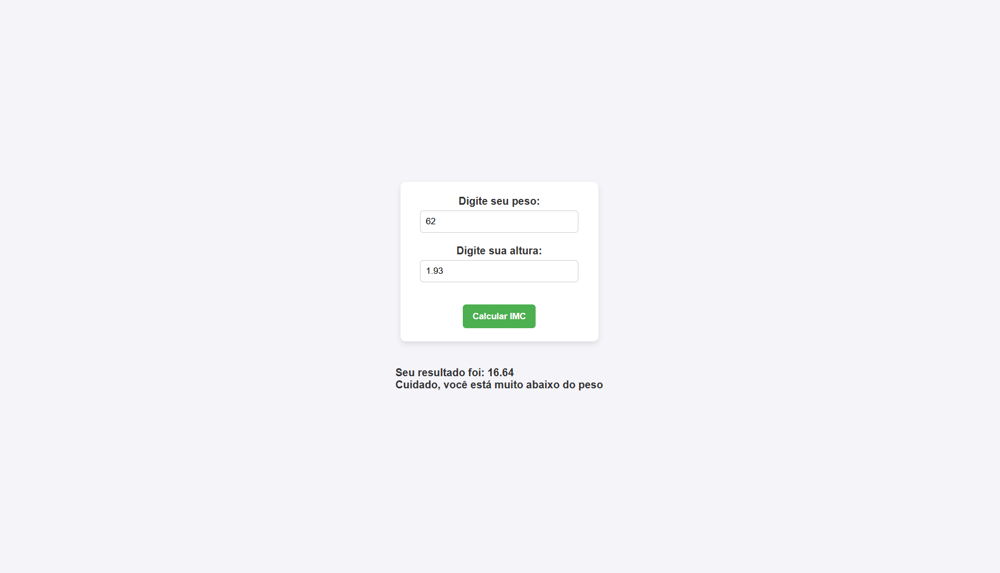

# 🧮 Calculadora de IMC

Uma calculadora de Índice de Massa Corporal (IMC) simples, interativa e responsiva desenvolvida em HTML, CSS e JavaScript. O projeto permite que o usuário insira seu peso e altura para obter o diagnóstico do seu status de peso atualizado instantaneamente, sem recarregar a página.

---

## 📸 Demonstração do Projeto

Abaixo estão as capturas de tela da interface e do funcionamento da aplicação:

### Tela Inicial
Aqui está a interface limpa e intuitiva onde o usuário pode inserir seus dados:

### Resultado da Consulta
Exemplo de feedback exibido na tela após o processamento do IMC:

---

## 🚀 Funcionalidades

- **Cálculo em Tempo Real:** Processamento imediato através do evento `onsubmit` utilizando JavaScript.
- **Prevenção de Recarregamento:** Uso de `event.preventDefault()` para garantir uma experiência SPA (Single Page Application) fluida.
- **Limpador Automático:** Os campos de entrada de dados são limpos automaticamente após a exibição do resultado para facilitar novas consultas.
- **Categorização Precisa:** Classificação do peso do usuário baseada nas faixas padrão de IMC.

---

## 📊 Regras de Classificação Utilizadas

O sistema classifica o resultado conforme os dados inseridos e a tabela oficial abaixo:

| IMC | Classificação |
| :--- | :--- |
| **Abaixo de 17** | Muito abaixo do peso |
| **Entre 17 e 18,49** | Abaixo do peso |
| **Entre 18,5 e 24,99** | Peso normal (adequado) |
| **A partir de 25** | Acima do peso |

---

## 🛠️ Tecnologias Utilizadas

- **HTML5:** Estruturação semântica dos formulários e elementos de saída.
- **CSS3:** Estilização e responsividade da interface (arquivo `style.css`).
- **JavaScript (ES6):** Manipulação de DOM e lógica de cálculo matemático (arquivo `script.js`).

---

## 📦 Como Executar o Projeto

1. Baixe ou clone este repositório em sua máquina local.
2. Certifique-se de que os arquivos `index.html`, `style.css`, `script.js`, `site.png` e `resultado.png` estejam na **mesma pasta (diretório raiz)**.
3. Dê um duplo clique no arquivo `index.html` para abrir diretamente no seu navegador web favorito.

---

Desenvolvido para fins de estudo e prática de manipulação de DOM com JavaScript puro. 💻✨